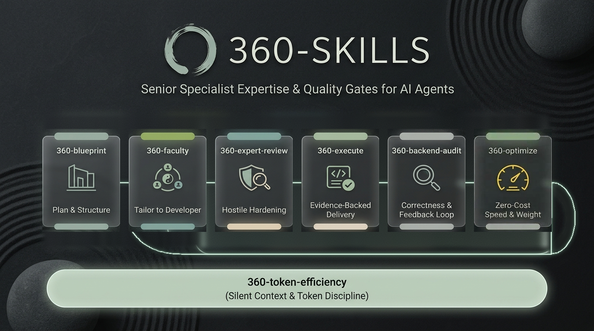
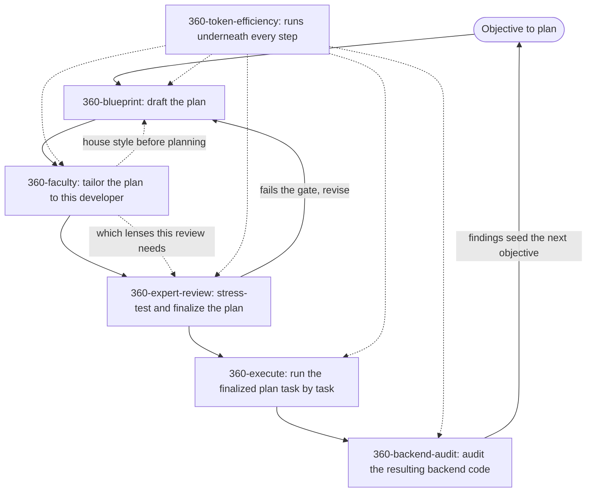

# 360-skills

[](LICENSE)
[](https://agentskills.io)
[](https://skills.sh)
[](llms.txt)
[](https://github.com/shahabahreini/360-skills/actions)

<p align="center">
  
</p>

**360-skills is an open collection of Agent Skills that give AI coding agents senior-level expertise for specific, high-stakes tasks.**

Most agents produce plausible work. Each skill in this repository packages the process, judgment, and quality gates of a senior specialist into a single installable `SKILL.md` file, so agents stop shipping the first draft and start shipping the vetted one. Skills follow the open [Agent Skills](https://agentskills.io) standard and install into Claude Code, Cursor, Codex, Copilot, Windsurf, Gemini CLI, and 70+ other agents through [skills.sh](https://skills.sh).

## Install

```bash
npx skills add shahabahreini/360-skills
```

The installer lists every skill in this repository and lets you choose which agents to install it for. To install a single skill non-interactively:

```bash
npx skills add shahabahreini/360-skills --skill 360-expert-review --agent claude-code
```

## Skills

| Skill                                                 | Description                                                                                                                                                                                                                                                                                                      | Version |
| ----------------------------------------------------- | ---------------------------------------------------------------------------------------------------------------------------------------------------------------------------------------------------------------------------------------------------------------------------------------------------------------- | ------- |
| [`360-blueprint`](skills/360-blueprint)               | Create an executable plan from a new objective — clarify first, write the full plan to a file, and brief the user in chat — when a goal exists but the path is unclear or the request is "plan this".                                                                                                          | 1.6.0   |
| [`360-faculty`](skills/360-faculty)                   | Seat a living, tailored expert team on a plan or task. Use when work must fit this developer's goals, taste, mindset, and strategy, when a plan needs the right expertise chosen for its complexity, depth, and nature, or when a named faculty team must be created, called, or updated. Recommends a short list, asks only the questions that still change the work, polishes immediately, and keeps upgradable memory. | 1.0.0   |
| [`360-expert-review`](skills/360-expert-review)       | Stress-test a draft plan, write the finalized executable plan back to the same file, and brief the user in chat. Use before executing any plan where a missed case could cause real damage.                                                                                                                    | 2.3.0   |
| [`360-execute`](skills/360-execute)                   | Execute a finalized plan task by task with a persisted coverage ledger, verify every item with evidence, and brief the user in chat. Use when a plan exists and work must begin, or when resuming a partial execution.                                                                                         | 1.1.0   |
| [`360-backend-audit`](skills/360-backend-audit)       | Deep-audit backend code, write the full report to a file, and brief the user in chat with bugs, updates, and dead weight. Use before or after significant backend work, or when inheriting, refactoring, or handing off services.                                                                             | 1.2.0   |
| [`360-token-efficiency`](skills/360-token-efficiency) | Runtime skill that reduces token waste during AI-agent tasks without dropping facts, changing requirements, or weakening correctness. Use continuously alongside other skills when token cost matters.                                                                                                         | 1.2.0   |

## Which Skill Do I Need?

| Your situation | Load |
| --- | --- |
| A goal exists, but no plan yet | `360-blueprint` |
| Unsure which expertise the work needs, before or after planning | `360-faculty` (suggest mode) |
| Work must fit this developer's goals, taste, and standing decisions | `360-faculty` |
| A named expert team must be created, called, or updated | `360-faculty` |
| A draft plan exists and needs hardening | `360-expert-review` |
| A finalized plan exists and needs building | `360-execute` |
| Backend code exists and needs auditing | `360-backend-audit` |
| Any of the above, and context or cost matters | add `360-token-efficiency` |

## How the Skills Work Together

Most skills hand off to one another sequentially on the same piece of work. Two are more flexible: `360-faculty` attaches wherever expertise is needed — before planning, after a draft, or ahead of review — and `360-token-efficiency` is a runtime overlay that runs underneath any of the others rather than a step of its own.



The four planning skills share one data contract: `360-blueprint`'s Plan Template. Every task carries a stable ID, a declared skill list, `must` / `should` / `could` priority, and an observable `Done when` check. `360-faculty` tailors the plan and `360-expert-review` hardens it, neither breaking that shape, and `360-execute` reads those exact fields. That is what lets a plan travel the whole pipeline without anyone re-typing it.

- **`360-blueprint`** turns a vague goal into a complete, unambiguous plan written directly to a file, briefing the user in chat with key decisions, assumptions, and risks.
- **`360-faculty`** seats a short list of named experts fitted to this developer and to the plan's own complexity, depth, and nature, tailoring it surgically, remembering what it learns, and saving reusable teams that can be called by name later.
- **`360-expert-review`** attacks that plan from every expert angle until only the strongest version survives, writing the finalized plan back to the file and briefing the user in chat.
- **`360-execute`** builds it, tracking every task in a coverage ledger written to disk, verifying each against its own acceptance check with evidence, and briefing progress in chat.
- **`360-backend-audit`** audits the resulting backend code for correctness, duplication, performance risks, and observability, writing the full report to a file and briefing findings in chat.
- **`360-token-efficiency`** runs continuously alongside whichever skill is active, reducing token waste without dropping facts, changing requirements, or weakening correctness.

Each skill also works standalone: ask `360-faculty` which expertise a plan needs without seating anyone, skip straight to `360-expert-review` for a plan someone else drafted, point `360-execute` at a plan someone else finalized, run `360-backend-audit` on existing code with no plan involved at all, or apply `360-token-efficiency` to any task regardless of which other skills are in play.

## Design Principles

1. **Expertise over templates**: skills simulate senior specialists, not checklists.
2. **Coverage over speed**: every scenario, every effect, every failure mode.
3. **Gates over suggestions**: nothing is "final" until it passes an explicit quality gate.
4. **Simplicity over ceremony**: brief, strong instructions any agent can follow.

## How Agent Skills Work

A skill is a folder containing a `SKILL.md` file with a `name`, a `description`, and step-by-step instructions. Agents load skills through progressive disclosure: they scan every skill's name and description at startup, then load the full instructions only when a task matches. This keeps many skills available at once without bloating the agent's context window. See the [Agent Skills specification](https://agentskills.io) for the full format.

## Repository Structure

```
360-skills/
├── README.md                  Project overview and install instructions
├── AGENTS.md                  Contributor guide for adding new skills
├── CONTRIBUTING.md            Quick pointer to contributor guide
├── llms.txt                   Machine-readable index for AI engines
├── llms-full.txt              Full compiled context for single-fetch LLM ingestion
├── LICENSE                    MIT license
├── faculty/                   Tailored expert dossiers and developer profile
├── scripts/
│   ├── build-llms-full.mjs    Compiles full documentation into llms-full.txt
│   └── check-consistency.mjs Validates skills against README and llms.txt
├── .github/workflows/
│   └── consistency.yml        Runs the validator on every push and PR
└── skills/
    ├── 360-blueprint/
    │   └── SKILL.md           Skill definition and instructions
    ├── 360-faculty/
    │   └── SKILL.md           Skill definition and instructions
    ├── 360-expert-review/
    │   └── SKILL.md           Skill definition and instructions
    ├── 360-execute/
    │   └── SKILL.md           Skill definition and instructions
    ├── 360-backend-audit/
    │   └── SKILL.md           Skill definition and instructions
    └── 360-token-efficiency/
        └── SKILL.md           Skill definition and instructions
```

## Contributing

New skills must follow the structure, naming, and quality bar defined in [AGENTS.md](AGENTS.md). In short: one skill per directory under `skills/`, kebab-case names prefixed with `360-`, required frontmatter (`name`, `description`, `version`), and a fixed section order (Purpose, When to Use, Core Principle, Workflow, Output Format, Quality Gate).

Before opening a pull request, run the consistency validator:

```bash
node scripts/check-consistency.mjs
```

It fails the build when a skill is missing from the README table or `llms.txt`, when a version or description has drifted from its `SKILL.md` frontmatter, when `llms-full.txt` is stale, or when a skill's section order is wrong.

## FAQ

**What is an Agent Skill?**
A portable, version-controlled folder that packages domain expertise and a repeatable workflow into instructions an AI agent can load on demand. See [agentskills.io](https://agentskills.io) for the open specification.

**Which AI agents can use these skills?**
Any agent supported by the [skills.sh](https://skills.sh) CLI, including Claude Code, Cursor, Codex, Windsurf, GitHub Copilot, OpenCode, and Gemini CLI.

**Why is it called 360-skills?**
Because the quality failures that matter most hide in the angles nobody checked. Every skill here is built to examine a problem from all sides before calling it done.

**How do I add a new skill?**
Read [AGENTS.md](AGENTS.md), create `skills/360-<name>/SKILL.md` following the required structure, then register it in this README's skills table.

## License

[MIT](LICENSE)
