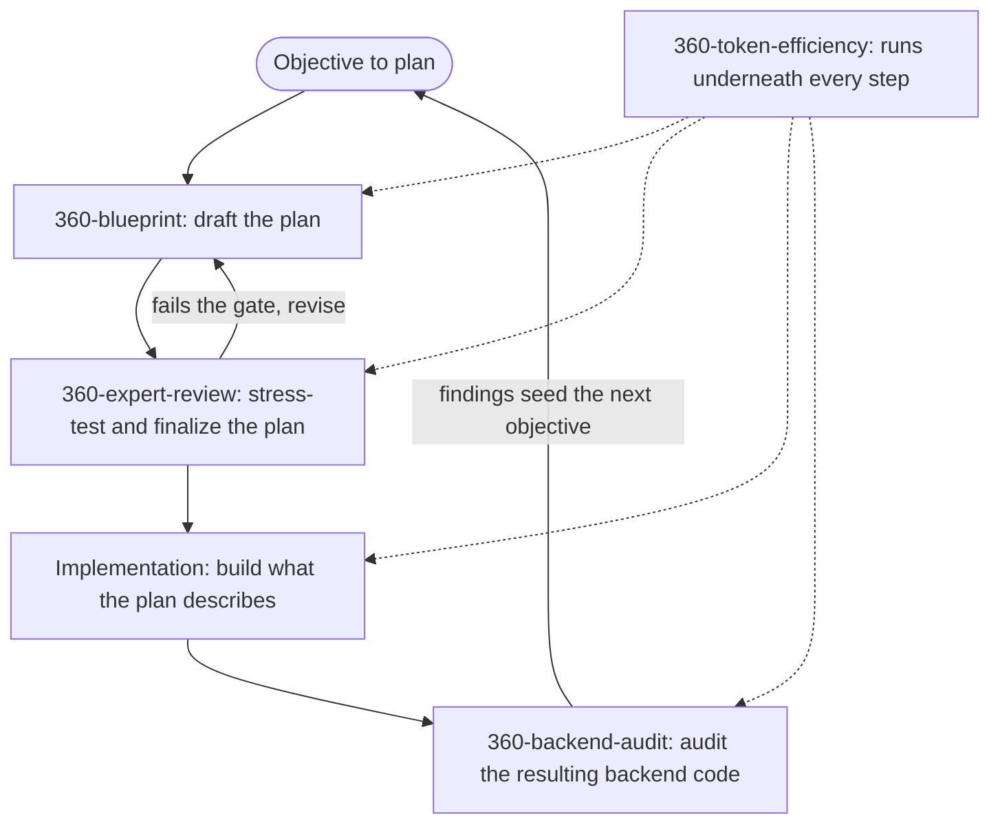

# 360-skills

[](LICENSE)
[](https://agentskills.io)
[](https://skills.sh)

**360-skills is an open collection of Agent Skills that give AI coding agents senior-level expertise for specific, high-stakes tasks.**

Most agents produce plausible work. Each skill in this repository packages the process, judgment, and quality gates of a senior specialist into a single installable `SKILL.md` file, so agents stop shipping the first draft and start shipping the vetted one. Skills follow the open [Agent Skills](https://agentskills.io) standard and install into Claude Code, Cursor, Codex, and 70+ other agents through [skills.sh](https://skills.sh).

## Install

```bash
npx skills add shahabahreini/360-skills
```

The installer lists every skill in this repository and lets you choose which agents to install it for. To install a single skill non-interactively:

```bash
npx skills add shahabahreini/360-skills --skill 360-expert-review --agent claude-code
```

## Skills

| Skill                                                 | Description                                                                                                                                                                                                                                                                                                      | Version |
| ----------------------------------------------------- | ---------------------------------------------------------------------------------------------------------------------------------------------------------------------------------------------------------------------------------------------------------------------------------------------------------------- | ------- |
| [`360-blueprint`](skills/360-blueprint)               | Universal plan creator for new objectives in any domain. Clarifies the real objective, separates confirmation from generation, avoids invented details, enforces domain quality, and produces a self-contained plan an agent can execute without guessing.                                                       | 1.5.0   |
| [`360-expert-review`](skills/360-expert-review)       | Pre-finalization plan review that stress-tests a draft plan for user impact, reliability, security, rollback, traceability, and failure modes. Uses direct expert lenses instead of persona theater and finalizes only after hostile review.                                                                     | 2.2.0   |
| [`360-backend-audit`](skills/360-backend-audit)       | Deep audit of backend code, APIs, services, business logic, data layers, integrations, and jobs. Verifies correctness, hunts dead weight and duplication, finds safe performance risks, hardens observability, and ends with a usable handover. Functionality, reliability, and accuracy are never traded away.  | 1.1.0   |
| [`360-token-efficiency`](skills/360-token-efficiency) | Runtime skill that reduces token waste during AI-agent tasks without dropping facts, changing requirements, or weakening correctness. Applies silent context discipline, effort sizing, progressive disclosure, compaction, and concise output. Use continuously alongside other skills when token cost matters. | 1.1.0   |

## How the Skills Work Together

Most skills hand off to one another sequentially on the same piece of work. `360-token-efficiency` is different: it is a runtime overlay that runs underneath any of the others rather than a step of its own.



- **`360-blueprint`** turns a vague goal into a complete, unambiguous plan with explicit assumptions, constraints, risks, and handover details.
- **`360-expert-review`** takes that plan and attacks it from every expert angle until only the strongest version survives, then, if requested, produces a zero-guesswork handover plan for the next AI agent.
- The finalized plan gets **implemented** (by a human, an agent, or both).
- **`360-backend-audit`** then audits the resulting backend code for correctness, duplication, performance risks, and observability, ending with a usable handover and feeding findings back into the next planning cycle.
- **`360-token-efficiency`** runs continuously alongside whichever skill is active, reducing token waste without dropping facts, changing requirements, or weakening correctness.

Each skill also works standalone: skip straight to `360-expert-review` for a plan someone else drafted, run `360-backend-audit` on existing code with no plan involved at all, or apply `360-token-efficiency` to any task regardless of which other skills are in play.

## Design Principles

1. **Expertise over templates**: skills simulate senior specialists, not checklists.
2. **Coverage over speed**: every scenario, every effect, every failure mode.
3. **Gates over suggestions**: nothing is "final" until it passes an explicit quality gate.
4. **Simplicity over ceremony**: brief, strong instructions any agent can follow.

## How Agent Skills Work

A skill is a folder containing a `SKILL.md` file with a `name`, a `description`, and step-by-step instructions. Agents load skills through progressive disclosure: they scan every skill's name and description at startup, then load the full instructions only when a task matches. This keeps many skills available at once without bloating the agent's context window. See the [Agent Skills specification](https://agentskills.io) for the full format.

## Repository Structure

```
360-skills/
├── README.md              Project overview and install instructions
├── AGENTS.md               Contributor guide for adding new skills
├── LICENSE                 MIT license
└── skills/
    ├── 360-blueprint/
    │   └── SKILL.md         Skill definition and instructions
    ├── 360-expert-review/
    │   └── SKILL.md         Skill definition and instructions
    ├── 360-backend-audit/
    │   └── SKILL.md         Skill definition and instructions
    └── 360-token-efficiency/
        └── SKILL.md         Skill definition and instructions
```

## Contributing

New skills must follow the structure, naming, and quality bar defined in [AGENTS.md](AGENTS.md). In short: one skill per directory under `skills/`, kebab-case names prefixed with `360-`, required frontmatter (`name`, `description`, `version`), and a fixed section order (Purpose, When to Use, Core Principle, Workflow, Output Format, Quality Gate).

## FAQ

**What is an Agent Skill?**
A portable, version-controlled folder that packages domain expertise and a repeatable workflow into instructions an AI agent can load on demand. See [agentskills.io](https://agentskills.io) for the open specification.

**Which AI agents can use these skills?**
Any agent supported by the [skills.sh](https://skills.sh) CLI, including Claude Code, Cursor, Codex, Windsurf, GitHub Copilot, OpenCode, and Gemini CLI.

**Why is it called 360-skills?**
Because the quality failures that matter most hide in the angles nobody checked. Every skill here is built to examine a problem from all sides before calling it done.

**How do I add a new skill?**
Read [AGENTS.md](AGENTS.md), create `skills/360-<name>/SKILL.md` following the required structure, then register it in this README's skills table.

## License

[MIT](LICENSE)
