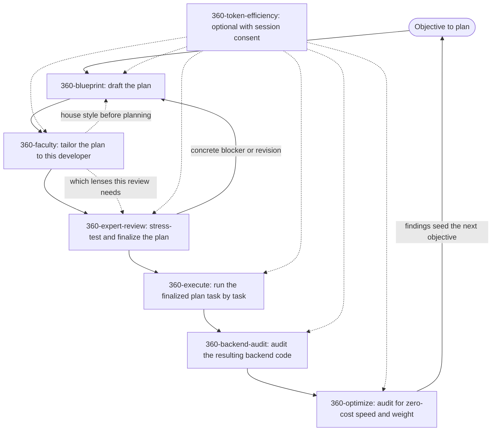

# 360-skills

[](LICENSE)
[](https://agentskills.io)
[](https://skills.sh)
[](llms.txt)
[](https://github.com/shahabahreini/360-skills/actions)

<p align="center">
  
</p>

**360-skills is an open collection of Agent Skills that give AI coding agents senior-level expertise for specific, high-stakes tasks.**

Most agents produce plausible work. Each skill in this repository packages the process, judgment, and quality gates of a senior specialist into an installable skill folder, to help agents produce work that can be reviewed against explicit checks. Skills follow the open [Agent Skills](https://agentskills.io) standard and install into Claude Code, Cursor, Codex, Copilot, Windsurf, Gemini CLI, and 70+ other agents through [skills.sh](https://skills.sh).

## Contents

| Topic | What you will find |
|---|---|
| [Install](#install) | Individual skills and optional dependencies |
| [Skills](#skills) | Descriptions and versions |
| [Routing](#which-skill-do-i-need) | Choose the right skill |
| [Workflow](#how-the-skills-work-together) | Shared plans and handovers |
| [Token efficiency](#optional-token-efficiency) | Consent, capabilities, accuracy and measurement |
| [Design principles](#design-principles) | Quality expectations |
| [Skill loading](#how-agent-skills-work) | Progressive disclosure |
| [Repository structure](#repository-structure) | Files and references |
| [Contributing](#contributing) | Validation commands |
| [FAQ](#faq) | Common questions |
| [License](#license) | MIT terms |

## Install

```bash
npx skills add shahabahreini/360-skills
```

The installer lists every skill in this repository and lets you choose which agents to install it for. To install a single skill non-interactively:

```bash
npx skills add shahabahreini/360-skills --skill 360-expert-review --agent claude-code
```

Each skill works individually. Review includes its own minimum plan contract; blueprint is not a required dependency. Install `360-token-efficiency` separately if you want the optional companion. A missing companion never blocks the primary task and is never installed automatically. Keep each skill's supporting `references/` directory with it.

## Skills

| Skill | Description | Version |
|---|---|---|
| [`360-backend-audit`](skills/360-backend-audit) | Deep-audit backend code, write the full report to a file, and brief the user in chat with bugs, updates, and dead weight. Use before or after significant backend work, or when inheriting, refactoring, or handing off services. | 2.0.0 |
| [`360-blueprint`](skills/360-blueprint) | Create an executable plan from a new objective with explicit tasks, constraints, and verification. Use when a goal exists but the path is unclear, or the request is "plan this". | 2.0.0 |
| [`360-execute`](skills/360-execute) | Execute a finalized plan task by task with a persisted coverage ledger, verify every item with evidence, and brief the user in chat. Use when a plan exists and work must begin, or when resuming a partial execution. | 2.0.0 |
| [`360-expert-review`](skills/360-expert-review) | Stress-test a draft plan, write the finalized executable plan back to the same file, and brief the user in chat. Use before executing any plan where a missed case could cause real damage. | 3.0.0 |
| [`360-faculty`](skills/360-faculty) | Seat a living, tailored expert team on a plan or task. Use when work must fit this developer's goals, taste, mindset, and strategy, when a plan needs the right expertise chosen for its complexity, depth, and nature, or when a named faculty team must be created, called, or updated. Recommends a short list, asks only the questions that still change the work, polishes immediately, and keeps upgradable memory. | 1.1.0 |
| [`360-optimize`](skills/360-optimize) | Audit working code for zero-cost speed, weight, and reliability gains — measure first, rank drop-in upgrades and restructures, and report conservative expected effects on this system. Use when existing code must run faster, lighter, or more robustly without changing what it does. | 2.0.0 |
| [`360-token-efficiency`](skills/360-token-efficiency) | Reduce avoidable context and tool-output overhead with capability-aware retrieval, reuse, and verified handovers. Use as an optional, session-approved companion when token cost or context growth matters, with strict preservation of task requirements by default. | 2.0.0 |

## Which Skill Do I Need?

| Your situation | Load | Not for |
|---|---|---|
| Backend correctness, dead weight, structure, or observability needs auditing | `360-backend-audit` | Not for planning work that does not exist yet (`360-blueprint`) or executing a plan (`360-execute`) |
| A goal exists, but no plan yet | `360-blueprint` | Not for hardening a plan that already exists (`360-expert-review`) or building one that is already final (`360-execute`) |
| An authorized plan needs implementation or resumption | `360-execute` | Not for creating plans (`360-blueprint`) or reviewing drafts (`360-expert-review`) |
| A draft plan needs adversarial review | `360-expert-review` | Not for drafting plans from scratch (`360-blueprint`) or executing a finalized plan (`360-execute`) |
| Choose expertise, tailor work to this developer, or manage a named team | `360-faculty` | Not for writing the plan itself (`360-blueprint`), attacking a finished draft (`360-expert-review`), or building one (`360-execute`) |
| Working code needs performance or weight recommendations | `360-optimize` | Not for greenfield design (`360-blueprint`), not for executing changes (`360-execute`), not for correctness or dead-weight hunts (`360-backend-audit`) |
| Context growth or avoidable token overhead matters; optional companion | `360-token-efficiency` | Not for creating plans (`360-blueprint`), executing the task itself (`360-execute`), or optimizing application performance (`360-optimize`) |

## How the Skills Work Together

Most skills hand off to one another sequentially on the same piece of work. Two are more flexible: `360-faculty` attaches wherever expertise is needed — before planning, after a draft, or ahead of review — and `360-token-efficiency` is an optional companion active only with session approval.



Plan producers and consumers carry the same local contract. Every task has ID, What, How, Where, Depends on, Skills (list or `None`), `Parallel: yes | no`, `Effort: S | M | L`, `Priority: must | should | could`, and an observable Done when. Only should/could work can sit below the cut line. Preserve checkpoints, change policy, replanning triggers, traceability, stable IDs and user decisions.

Readiness moves from `Draft` to `Ready for review` to `Reviewed and ready to execute`. Material edits invalidate prior review; execution progress stays in the coverage ledger. A direct user instruction to execute a supplied plan is sufficient authorization without forcing another skill review; record that basis honestly. Handover fields are Context, Decisions, State (done / pending / blocked), Remaining tasks (what, how, where), Verification, and Risks and how to detect them early.

- **`360-blueprint`** turns a vague goal into a complete, unambiguous plan written directly to a file, briefing the user in chat with key decisions, assumptions, and risks.
- **`360-faculty`** seats a short list of named experts fitted to this developer and to the plan's own complexity, depth, and nature, tailoring it surgically, remembering what it learns, and saving reusable teams that can be called by name later.
- **`360-expert-review`** attacks that plan from every expert angle until only the strongest version survives, writing the finalized plan back to the file and briefing the user in chat.
- **`360-execute`** builds it, tracking every task in a coverage ledger written to disk, verifying each against its own acceptance check with evidence, and briefing progress in chat.
- **`360-backend-audit`** audits the resulting backend code for correctness, duplication, performance risks, and observability, writing the full report to a file and briefing findings in chat.
- **`360-optimize`** audits working code for zero-cost speed, weight, and reliability gains, ranking drop-in upgrades and restructures with conservative expected effects written to a file and briefing highlights in chat.
- **`360-token-efficiency`** runs alongside the active task with session consent, reducing avoidable overhead while preserving requirements and required checks.

Each skill also works standalone: ask `360-faculty` which expertise a plan needs without seating anyone, skip straight to `360-expert-review` for a plan someone else drafted, point `360-execute` at a plan someone else finalized, run `360-backend-audit` on existing code with no plan involved at all, audit working code for performance and weight with `360-optimize`, or apply `360-token-efficiency` to any task regardless of which other skills are in play.

## Optional Token Efficiency

Every sibling offers the companion once per session and reuses your approval or refusal across handoffs. Explicitly invoking it approves it for that session; a generated plan listing it does not. Unanswered offers leave it inactive. You can revoke consent immediately. A new session starts without approval, and consent does not authorize cross-session memory writes. Declining still permits ordinary efficient work.

The companion chooses techniques from capabilities the host actually exposes: search, selective reads, tool discovery, result processing, recoverable artifacts, context management, caching controls, delegation, and telemetry. Unknown capabilities stay unavailable. It does not rewrite agent configuration or installed instructions.

Strict accuracy is the default: never intentionally weaken requirements, exact values, evidence, uncertainty, or verification to save tokens. This is a working rule, not a guarantee that an AI cannot make mistakes. Potentially lossy compression requires separate approval of the technique, task-specific metric and tolerance. Missing or conflicting evidence triggers fuller retrieval or the ordinary workflow.

Caching can reduce processing cost without reducing context size. Savings reports are optional; absent telemetry is labeled `UNMEASURED`. Comparisons include skill loading, summarization, retries and delegation overhead, and use the same acceptance checks. See [evidence and limitations](skills/360-token-efficiency/references/evidence-and-techniques.md) and the [evaluation record](docs/validation/token-efficiency-redesign.md).

All skills prefer files where supported, honor explicit output requests, and provide complete in-session deliverables when files are unavailable. They label that fallback honestly.

## Design Principles

1. **Expertise over templates**: skills simulate senior specialists, not checklists.
2. **Coverage over speed**: every scenario, every effect, every failure mode.
3. **Gates over suggestions**: nothing is "final" until it passes an explicit quality gate.
4. **Simplicity over ceremony**: brief, strong instructions any agent can follow.

## How Agent Skills Work

A skill is a folder containing a `SKILL.md` file with a `name`, a `description`, and step-by-step instructions. Agents load skills through progressive disclosure: they scan every skill's name and description at startup, then load the full instructions only when a task matches. This keeps many skills available at once without bloating the agent's context window. See the [Agent Skills specification](https://agentskills.io) for the full format.

## Repository Structure

```
360-skills/
├── README.md                  Project overview and install instructions
├── AGENTS.md                  Contributor guide for adding new skills
├── CONTRIBUTING.md            Quick pointer to contributor guide
├── llms.txt                   Machine-readable index for AI engines
├── llms-full.txt              Full compiled context for single-fetch LLM ingestion
├── LICENSE                    MIT license
├── docs/validation/           Redesign coverage and behavioral evaluation record
├── scripts/
│   ├── build-llms-full.mjs    Compiles full documentation into llms-full.txt
│   ├── check-consistency.mjs Validates metadata, contracts, links and indexes
│   ├── lib/                   Shared validator conventions
│   └── consistency.test.mjs   Valid and invalid repository fixtures
├── .github/workflows/
│   └── consistency.yml        Tests and validates on main pushes and PRs
└── skills/
    ├── 360-blueprint/
    │   └── SKILL.md           Skill definition and instructions
    ├── 360-faculty/
    │   ├── SKILL.md           Skill definition and instructions
    │   └── references/        Optional seating roster
    ├── 360-expert-review/
    │   └── SKILL.md           Skill definition and instructions
    ├── 360-execute/
    │   └── SKILL.md           Skill definition and instructions
    ├── 360-backend-audit/
    │   └── SKILL.md           Skill definition and instructions
    ├── 360-optimize/
    │   └── SKILL.md           Skill definition and instructions
    └── 360-token-efficiency/
        ├── SKILL.md           Skill definition and instructions
        └── references/        Evidence and optional techniques
```

Supporting references: faculty has an optional [seating roster](skills/360-faculty/references/seating-roster.md); token efficiency has optional evidence and technique guidance. Runtime faculty dossiers belong beside the user's plan and are not part of this catalog.

## Contributing

New skills must follow the structure, naming, and quality bar defined in [AGENTS.md](AGENTS.md). In short: one skill per directory under `skills/`, kebab-case names prefixed with `360-`, required frontmatter (`name`, `description`, `version`), and a fixed section order (Purpose, When to Use, Core Principle, Workflow, Output Format, Quality Gate).

Before opening a pull request, run the consistency validator:

```bash
node scripts/build-llms-full.mjs
node --test scripts/*.test.mjs
node scripts/check-consistency.mjs
```

The checker validates exact frontmatter fields, naming, section order, shared contracts, negative routing, local links, index registration, and compiled documentation (including references). Tests cover valid and invalid fixtures; they do not establish runtime accuracy. Behavioral scenarios and observed limitations live in the evaluation record.

## FAQ

**What is an Agent Skill?**
A portable, version-controlled folder that packages domain expertise and a repeatable workflow into instructions an AI agent can load on demand. See [agentskills.io](https://agentskills.io) for the open specification.

**Which AI agents can use these skills?**
Any agent supported by the [skills.sh](https://skills.sh) CLI, including Claude Code, Cursor, Codex, Windsurf, GitHub Copilot, OpenCode, and Gemini CLI.

**Why is it called 360-skills?**
Because the quality failures that matter most hide in the angles nobody checked. Every skill here is built to examine a problem from all sides before calling it done.

**How do I add a new skill?**
Read [AGENTS.md](AGENTS.md), create `skills/360-<name>/SKILL.md` following the required structure, then register it in this README's skills table.

## License

[MIT](LICENSE)
